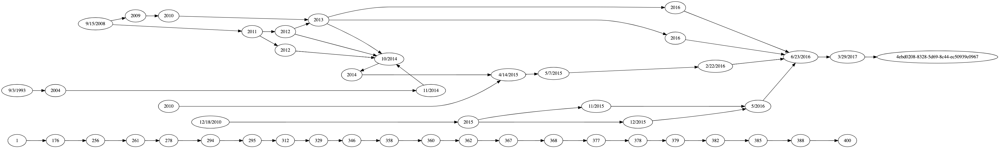

# Notes

```dot

strict digraph brexit {
      rankdir="LR"
            "1" -> "176" -> "256" -> "261" -> "278" -> "294" -> "295" -> "312" -> "329" -> "346" -> "358" -> "360" -> "362" -> "367" -> "368" -> "377" -> "378" -> "379" -> "382" -> "385" -> "388" -> "400"

      		 "728227f1-07a2-53b1-baa9-d93a21025604" [label="9/3/1993"];
 		 "ce2ed052-e226-505a-8a18-19b9e0949dad" [label="2004"];
 		 "70c4e985-8b27-5d6f-b848-c8522fe9f19b" [label="9/15/2008"];
 		 "70c4e985-8b27-5d6f-b848-c8522fe9f19b" [label="9/15/2008"];
 		 "8c1b230c-0eea-5331-90ac-9ed5d60f843b" [label="2009"];
 		 "18492647-d960-5879-ba69-146966ad13cb" [label="2010"];
 		 "270177e1-4f44-5f25-809f-22f0ff06c5b5" [label="2010"];
 		 "02c04fb1-c5ec-5aaf-b6ab-b03891da65fa" [label="12/18/2010"];
 		 "938a8516-8bce-5260-a7fe-740efda94315" [label="2011"];
 		 "938a8516-8bce-5260-a7fe-740efda94315" [label="2011"];
 		 "c13254a0-ea0f-5ffd-a1e1-5bf3272c8a0a" [label="2012"];
 		 "c13254a0-ea0f-5ffd-a1e1-5bf3272c8a0a" [label="2012"];
 		 "7eb9b927-083e-5892-bdfb-b8a58a7eccb9" [label="2012"];
 		 "4e86a3d0-ad98-5ba5-89ea-5e463dfc8f2a" [label="2013"];
 		 "4e86a3d0-ad98-5ba5-89ea-5e463dfc8f2a" [label="2013"];
 		 "4e86a3d0-ad98-5ba5-89ea-5e463dfc8f2a" [label="2013"];
 		 "8018e54e-e5e7-57bc-90a0-998f498dd260" [label="2014"];
 		 "fa5cf9f9-cbbd-5447-82b3-ff794d840773" [label="10/2014"];
 		 "343d373e-fe03-51eb-ace3-ab42699105b8" [label="11/2014"];
 		 "1b03e137-a965-5f76-ad62-3976af5e29ec" [label="2015"];
 		 "1b03e137-a965-5f76-ad62-3976af5e29ec" [label="2015"];
 		 "45adf7e6-682e-5a73-96e0-2f32eaa62d3b" [label="4/14/2015"];
 		 "28b83582-961a-52ed-bcef-dc022b21d0fb" [label="5/7/2015"];
 		 "09ddef64-2c4f-5ff3-9605-18da2251bf51" [label="11/2015"];
 		 "929a212e-af5b-59a8-8f6f-33805202444f" [label="12/2015"];
 		 "94319864-6003-5d9c-a010-3ca959d79a29" [label="2016"];
 		 "fab16199-a3c9-5942-8ad1-6e761de38d38" [label="2016"];
 		 "ae103e7b-676d-5b3d-9eb2-c0f69f43c63b" [label="2/22/2016"];
 		 "900abd27-3ac1-5f7b-b85a-ff796fc2de88" [label="5/2016"];
 		 "60f42ad1-5294-5279-8dde-f07b8fb368c9" [label="6/23/2016"];
 		 "d85640ea-b2f2-51d1-8dda-5858c1b79753" [label="3/29/2017"];


      {rank = same; 1 "728227f1-07a2-53b1-baa9-d93a21025604"};
  	 	 {rank = same; 176 "ce2ed052-e226-505a-8a18-19b9e0949dad"};
  	 	 {rank = same; 256 "70c4e985-8b27-5d6f-b848-c8522fe9f19b" "70c4e985-8b27-5d6f-b848-c8522fe9f19b"};
  	 	 {rank = same; 261 "8c1b230c-0eea-5331-90ac-9ed5d60f843b"};
  	 	 {rank = same; 278 "18492647-d960-5879-ba69-146966ad13cb" "270177e1-4f44-5f25-809f-22f0ff06c5b5"};
  	 	 {rank = same; 294 "02c04fb1-c5ec-5aaf-b6ab-b03891da65fa"};
  	 	 {rank = same; 295 "938a8516-8bce-5260-a7fe-740efda94315" "938a8516-8bce-5260-a7fe-740efda94315"};
  	 	 {rank = same; 312 "c13254a0-ea0f-5ffd-a1e1-5bf3272c8a0a" "c13254a0-ea0f-5ffd-a1e1-5bf3272c8a0a" "7eb9b927-083e-5892-bdfb-b8a58a7eccb9"};
  	 	 {rank = same; 329 "4e86a3d0-ad98-5ba5-89ea-5e463dfc8f2a" "4e86a3d0-ad98-5ba5-89ea-5e463dfc8f2a" "4e86a3d0-ad98-5ba5-89ea-5e463dfc8f2a"};
  	 	 {rank = same; 346 "8018e54e-e5e7-57bc-90a0-998f498dd260"};
  	 	 {rank = same; 358 "fa5cf9f9-cbbd-5447-82b3-ff794d840773"};
  	 	 {rank = same; 360 "343d373e-fe03-51eb-ace3-ab42699105b8"};
  	 	 {rank = same; 362 "1b03e137-a965-5f76-ad62-3976af5e29ec" "1b03e137-a965-5f76-ad62-3976af5e29ec"};
  	 	 {rank = same; 367 "45adf7e6-682e-5a73-96e0-2f32eaa62d3b"};
  	 	 {rank = same; 368 "28b83582-961a-52ed-bcef-dc022b21d0fb"};
  	 	 {rank = same; 377 "09ddef64-2c4f-5ff3-9605-18da2251bf51"};
  	 	 {rank = same; 378 "929a212e-af5b-59a8-8f6f-33805202444f"};
  	 	 {rank = same; 379 "94319864-6003-5d9c-a010-3ca959d79a29" "fab16199-a3c9-5942-8ad1-6e761de38d38"};
  	 	 {rank = same; 382 "ae103e7b-676d-5b3d-9eb2-c0f69f43c63b"};
  	 	 {rank = same; 385 "900abd27-3ac1-5f7b-b85a-ff796fc2de88"};
  	 	 {rank = same; 388 "60f42ad1-5294-5279-8dde-f07b8fb368c9"};
  	 	 {rank = same; 400 "d85640ea-b2f2-51d1-8dda-5858c1b79753"};


      "728227f1-07a2-53b1-baa9-d93a21025604" -> "ce2ed052-e226-505a-8a18-19b9e0949dad";
		"ce2ed052-e226-505a-8a18-19b9e0949dad" -> "343d373e-fe03-51eb-ace3-ab42699105b8";
		"70c4e985-8b27-5d6f-b848-c8522fe9f19b" -> "8c1b230c-0eea-5331-90ac-9ed5d60f843b";
		"70c4e985-8b27-5d6f-b848-c8522fe9f19b" -> "938a8516-8bce-5260-a7fe-740efda94315";
		"8c1b230c-0eea-5331-90ac-9ed5d60f843b" -> "18492647-d960-5879-ba69-146966ad13cb";
		"18492647-d960-5879-ba69-146966ad13cb" -> "4e86a3d0-ad98-5ba5-89ea-5e463dfc8f2a";
		"270177e1-4f44-5f25-809f-22f0ff06c5b5" -> "45adf7e6-682e-5a73-96e0-2f32eaa62d3b";
		"02c04fb1-c5ec-5aaf-b6ab-b03891da65fa" -> "1b03e137-a965-5f76-ad62-3976af5e29ec";
		"938a8516-8bce-5260-a7fe-740efda94315" -> "c13254a0-ea0f-5ffd-a1e1-5bf3272c8a0a";
		"938a8516-8bce-5260-a7fe-740efda94315" -> "7eb9b927-083e-5892-bdfb-b8a58a7eccb9";
		"c13254a0-ea0f-5ffd-a1e1-5bf3272c8a0a" -> "4e86a3d0-ad98-5ba5-89ea-5e463dfc8f2a";
		"c13254a0-ea0f-5ffd-a1e1-5bf3272c8a0a" -> "fa5cf9f9-cbbd-5447-82b3-ff794d840773";
		"7eb9b927-083e-5892-bdfb-b8a58a7eccb9" -> "fa5cf9f9-cbbd-5447-82b3-ff794d840773";
		"4e86a3d0-ad98-5ba5-89ea-5e463dfc8f2a" -> "94319864-6003-5d9c-a010-3ca959d79a29";
		"4e86a3d0-ad98-5ba5-89ea-5e463dfc8f2a" -> "fab16199-a3c9-5942-8ad1-6e761de38d38";
		"4e86a3d0-ad98-5ba5-89ea-5e463dfc8f2a" -> "fa5cf9f9-cbbd-5447-82b3-ff794d840773";
		"8018e54e-e5e7-57bc-90a0-998f498dd260" -> "45adf7e6-682e-5a73-96e0-2f32eaa62d3b";
		"fa5cf9f9-cbbd-5447-82b3-ff794d840773" -> "8018e54e-e5e7-57bc-90a0-998f498dd260";
		"343d373e-fe03-51eb-ace3-ab42699105b8" -> "fa5cf9f9-cbbd-5447-82b3-ff794d840773";
		"1b03e137-a965-5f76-ad62-3976af5e29ec" -> "929a212e-af5b-59a8-8f6f-33805202444f";
		"1b03e137-a965-5f76-ad62-3976af5e29ec" -> "09ddef64-2c4f-5ff3-9605-18da2251bf51";
		"45adf7e6-682e-5a73-96e0-2f32eaa62d3b" -> "28b83582-961a-52ed-bcef-dc022b21d0fb";
		"28b83582-961a-52ed-bcef-dc022b21d0fb" -> "ae103e7b-676d-5b3d-9eb2-c0f69f43c63b";
		"09ddef64-2c4f-5ff3-9605-18da2251bf51" -> "900abd27-3ac1-5f7b-b85a-ff796fc2de88";
		"929a212e-af5b-59a8-8f6f-33805202444f" -> "900abd27-3ac1-5f7b-b85a-ff796fc2de88";
		"94319864-6003-5d9c-a010-3ca959d79a29" -> "60f42ad1-5294-5279-8dde-f07b8fb368c9";
		"fab16199-a3c9-5942-8ad1-6e761de38d38" -> "60f42ad1-5294-5279-8dde-f07b8fb368c9";
		"ae103e7b-676d-5b3d-9eb2-c0f69f43c63b" -> "60f42ad1-5294-5279-8dde-f07b8fb368c9";
		"900abd27-3ac1-5f7b-b85a-ff796fc2de88" -> "60f42ad1-5294-5279-8dde-f07b8fb368c9";
		"60f42ad1-5294-5279-8dde-f07b8fb368c9" -> "d85640ea-b2f2-51d1-8dda-5858c1b79753";
		"d85640ea-b2f2-51d1-8dda-5858c1b79753" -> "4ebd0208-8328-5d69-8c44-ec50939c0967";


    }



```





-- Base64 Encoded --

> Used for the rendering microservice

```base64

ZGlncmFwaCBicmV4aXQgewogICAgMTk5MyAtPiAyMDAzIC0+IDIwMDggLT4gMjAwOSAtPiAyMDEwIC0+IDIwMTEgLT4gMjAxMiAtPiAyMDEzIC0+IDIwMTQgLT4gMjAxNSAtPiAyMDE2IC0+IDIwMTc7CiAgICAyIFtsYWJlbD0iU2VwIDNyZCAxOTkzIl0KICAgIDIzIFtsYWJlbD0iRGVjIDMxc3QgMjAwMyJdCiAgICAxIFtsYWJlbD0iU2VwIDE1dGggMjAwOCJdCiAgICAxNCBbbGFiZWw9IkRlYyAzMXN0IDIwMDgiXQogICAgMTUgW2xhYmVsPSJEZWMgMzFzdCAyMDA5Il0KICAgIDI1IFtsYWJlbD0iRGVjIDMxc3QgMjAwOSJdCiAgICAzIFtsYWJlbD0iRGVjIDE4dGggMjAxMCJdCiAgICAxNiBbbGFiZWw9IkRlYyAzMXN0IDIwMTAiXQogICAgMTcgW2xhYmVsPSJEZWMgMzFzdCAyMDExIl0KICAgIDIyIFtsYWJlbD0iRGVjIDMxc3QgMjAxMSJdCiAgICA0IFtsYWJlbD0iRGVjIDMxc3QgMjAxMiJdCiAgICA4IFtsYWJlbD0iRGVjIDMxc3QgMjAxMyJdCiAgICA1IFtsYWJlbD0iRGVjIDMxc3QgMjAxNCJdCiAgICA3IFtsYWJlbD0iT2N0IDFzdCAyMDE0Il0KICAgIDI0IFtsYWJlbD0iTm92IDFzdCAyMDE0Il0KICAgIDkgW2xhYmVsPSJBcHIgMTR0aCAyMDE1Il0KICAgIDEwIFtsYWJlbD0iTWF5IDd0aCAyMDE1Il0KICAgIDE4IFtsYWJlbD0iRGVjIDFzdCAyMDE1Il0KICAgIDE5IFtsYWJlbD0iRGVjIDMxc3QgMjAxNSJdCiAgICAyMCBbbGFiZWw9IkRlYyAzMXN0IDIwMTUiXQogICAgMjEgW2xhYmVsPSJOb3YgMXN0IDIwMTUiXQogICAgNiBbbGFiZWw9Ik1heSAxc3QgMjAxNiJdCiAgICAxMSBbbGFiZWw9IkZlYiAyMm5kIDIwMTYiXQogICAgMTIgW2xhYmVsPSJKdW4gMjNyZCAyMDE2Il0KICAgIDEzIFtsYWJlbD0iTWFyIDI5dGggMjAxNyJdCiAgICB7cmFuayA9IHNhbWU7IDE5OTMgIjIiOyB9CiAgICB7cmFuayA9IHNhbWU7IDIwMDMgIjIzIjsgfQogICAge3JhbmsgPSBzYW1lOyAyMDA4ICIxIiAiMTQiOyB9CiAgICB7cmFuayA9IHNhbWU7IDIwMDkgIjE1IiAiMjUiOyB9CiAgICB7cmFuayA9IHNhbWU7IDIwMTAgIjMiICIxNiI7IH0KICAgIHtyYW5rID0gc2FtZTsgMjAxMSAiMTciICIyMiI7IH0KICAgIHtyYW5rID0gc2FtZTsgMjAxMiAiNCI7IH0KICAgIHtyYW5rID0gc2FtZTsgMjAxMyAiOCI7IH0KICAgIHtyYW5rID0gc2FtZTsgMjAxNCAiNSIgIjciICIyNCI7IH0KICAgIHtyYW5rID0gc2FtZTsgMjAxNSAiOSIgIjEwIiAiMTgiICIxOSIgIjIwIiAiMjEiOyB9CiAgICB7cmFuayA9IHNhbWU7IDIwMTYgIjYiICIxMSIgIjEyIjsgfQogICAge3JhbmsgPSBzYW1lOyAyMDE3ICIxMyI7IH0KICAgICIyNSIgLT4gIjkiOwogICAgIjI0IiAtPiAiNyI7CiAgICAiMjMiIC0+ICIyNCI7CiAgICAiMjIiIC0+ICI3IjsKICAgICIyMSIgLT4gIjYiOwogICAgIjIwIiAtPiAiMTIiOwogICAgIjE5IiAtPiAiMTIiOwogICAgIjE4IiAtPiAiNiI7CiAgICAiMTciIC0+ICI0IjsKICAgICIxNyIgLT4gIjciOwogICAgIjE1IiAtPiAiMTciOwogICAgIjE0IiAtPiAiMTUiOwogICAgIjEyIiAtPiAiMTMiOwogICAgIjExIiAtPiAiMTIiOwogICAgIjEwIiAtPiAiMTEiOwogICAgIjkiIC0+ICIxMCI7CiAgICAiNyIgLT4gIjgiOwogICAgIjgiIC0+ICI5IjsKICAgICI2IiAtPiAiMTIiOwogICAgIjUiIC0+ICIyMSI7CiAgICAiNSIgLT4gIjE4IjsKICAgICI0IiAtPiAiMTkiOwogICAgIjQiIC0+ICIyMCI7CiAgICAiNCIgLT4gIjciOwogICAgIjMiIC0+ICI1IjsKICAgICIyIiAtPiAiMjMiOwogICAgIjEiIC0+ICIxNiI7CiAgICAiMSIgLT4gIjE0IjsKICAgICIxNiIgLT4gIjIyIjsKICAgICIxNiIgLT4gIjE3IjsKICAgICIxNSIgLT4gIjQiOwp9
```

The Graphviz server takes the above base64 encoded object, expands it into the aforementioned dot notation, which yields a rudamentary graph (see above figure) - we then convert that image to an svg, find the center of each node, hide the subgraph (date connectors), and return that as an annotated object.

_in summary:_ dot -> base64 -> svg -> json

Q: Why didn't we just use many of the Dot notation converts?
A: Many of the converted graphs (especially the Javascript ones) didn't support all the features of the older desktop app. This allows us to avoid colissions AND align nodes along a common Y-axis, denoted by date(range). Essentially keeping both the x and y axis in check to properly &amp; automatically space-out the graph.

Links:

- [GraphViz](https://graphviz.org/)
- [Dot Notation](<https://en.wikipedia.org/wiki/DOT_(graph_description_language)>)
